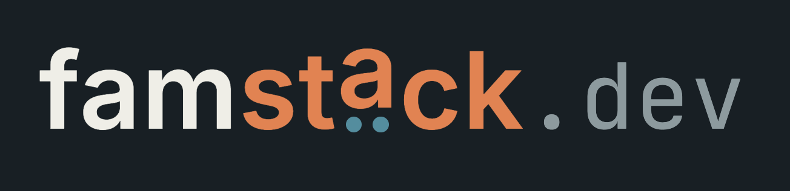

<p align="center">
  <a href="https://famstack.dev">
    
  </a>
</p>

<p align="center">
  <a href="https://famstack.dev"></a>
  <a href="https://discord.gg/hfutdmmfBe"></a>
  <a href="https://bsky.app/profile/famstack.dev"></a>
  <a href="https://github.com/famstack-dev"></a>
  <a href="https://x.com/arthwaredev"></a>
</p>

<p align="center">
  
  
  
</p>

**Turn your Mac into the brain of your household and operate it from your phone.**
Photos, memories, documents, chat, local AI: local and private by default, gets smarter over time. Open source.

*"I built this because our photos, our voices, our documents: That's our life. It belongs on our hardware, not in someone else's cloud."*

The reference implementation runs on a Mac Studio M1 in our living room at Lake Constance, Germany. Where is yours going to run?
<br>


## Quick Start

```bash
git clone https://github.com/famstack-dev/famstack.git && cd famstack
./stack         # Starts the Installer
```

- [User Guide](docs/guide.md) - Install, configure, day-to-day operations, troubleshooting

Works on any Mac with Apple Silicon. Twenty minutes from clone to a working family server on your machine.

The fastest way to get Immich and Paperless running on your Mac.

<p align="center">
  
</p>

---

## Who This Is For

People who know what a Terminal is. Families that are interested in Tech. Families who are tired of uploading their kids' photos to servers they don't control. 
Parents who'd rather spend Saturday morning with their kids or tinkering rather than searching for a specific important document.
Families who want to take advantage of tech and store memories of their lives where it belongs: your home.

No Linux experience required, no Docker knowledge assumed. If you can run a shell command, you can run famstack.


## Why I Built This

I was manually copying photos off my phone with a cable. Like a caveman. 
Twenty years of automating things for businesses as a veteran software engineer, and my own family was running on drawers full of paper and a 15-year-old Synology NAS that hadn't seen an update in years.

Four weeks ago we started recording our kids' voices in a family chat room. 
Tiny moments, funny things they said, bedtime stories in their own words. 
We wished we'd started with our first son. Those memories would be gone forever. Now they're not.
They live on our own server, transcribed, searchable.

That's what this is. An open source stack that puts photos, documents, family memories and local AI on a Mac in your home. 
Private, no subscriptions, and no cloud provider that might shut down next year.
But it's not just archiving. The goal is a family operating system: something that remembers, organizes, and eventually runs the boring parts of everyday life for you. Think JARVIS, built one stacklet and bot at a time.

[Read more on the website](https://famstack.dev/why/).

---

## Getting Started

### Requirements

- macOS on Apple Silicon (M1+)
- [OrbStack](https://orbstack.dev) (recommended) or Docker Desktop
- [Homebrew](https://brew.sh) (Optional: Only for managed AI right now)


OrbStack has its own installer at [orbstack.dev](https://orbstack.dev).

### Install

The installer checks dependencies, sets up your data directory and gets the nervous system of your Mac running Element X and Matrix:
It prepares everything. Once you login to your private Element X, you can operate the stack from your Server Room. Or your Terminal. 
The installer will guide you.

```bash
git clone https://github.com/famstack-dev/famstack.git
cd famstack
./stack
```

```bash
./stack up docs        # Paperless-ngx: document archive with OCR
./stack up ai          # Local AI: TTS, Whisper, oMLX
./stack up photos      # Immich: family photo library + mobile backup

```

Check everything is running:

```bash
./stack status
```

> [!NOTE]
> **v0.2.0** Back in the day we would have called it "Beta". **It works on my machine.™**
> I gave my best it works on yours too. If it doesn't, come back and report it
> or join our [Discord](https://discord.gg/hfutdmmfBe).
> If it works: please share it. A star, a post, a mention. That's what keeps a project like this alive.

---

## How It Works

famstack is composed of **[stacklets](docs/stack-reference.md)**: self-contained mini-stacks that snap together. 
Each stacklet is just Docker Compose, shell scripts, and a TOML manifest. No custom runtime. 
Convention over configuration and a small CLI gluing it together. It's just a convenience layer on top of existing
open source technologies. No lock-in. You don't need an eject button, because there is nothing to eject.

```
famstack/
├── stack                    CLI (single Python file, zero pip deps)
├── stack.toml               User configuration (domain, data dir, timezone)
└── stacklets/
    ├── core/
    │   └── stacklet.toml    Always-on infrastructure (Caddy, Watchtower)
    └── photos/
        ├── stacklet.toml    Manifest: identity, env config, health check
        ├── docker-compose.yml
        ├── setup.sh         First-run setup (idempotent)
        ├── caddy.snippet    Reverse proxy config
        └── .env             Auto-generated by 'stack up'
```

### .env is a derived artifact

I was quite annoyed with juggling a gazillion .env files and with secrets. So I fixed it.
One central configuration, one single source of truth. Everything else is just derived.

No manual `.env` editing. `stack up` generates it every time from three sources:

1. **stack.toml** for paths, domain, timezone
2. **stacklet.toml `[env.defaults]`** for templates like `{data_dir}/photos/library`
3. **.famstack/secrets.toml** for auto-generated passwords (created once, reused on re-up)

Change something in `stack.toml`, run `stack up` again, and the `.env` regenerates to match.

### Data

All persistent data lives in `~/famstack-data/<stacklet>/` (configurable) outside the repo. 
Each stacklet owns its subdirectory. `stack destroy` wipes it, so back up that directory separately.

---

## Stacklets

Each stacklet except core and messages is opt-in. You can mix and match them as you please.
Messages is optional in theory (But without it, the whole point of famstack is a bit neglected).
Messages allows you to operate the stack from your smartphone. 

famstack comes with a lightweight bot runtime. The bots are tiny helpers that automate tasks in your family chat: filing documents, transcribing voice memos, managing your stack. Experimenting with [nanobot](https://github.com/HKUDS/nanobot)-based agent bots too.

| Stacklet | Status  | Service                | What it does                                             |
|----------|---------|------------------------|----------------------------------------------------------|
| core     | working | Bot Runner, Watchtower | Reverse proxy and the famstack Bot runner                |
| messages | working | Matrix + Element       | The famstack central WhatsApp-like communication center. |
| photos   | working | Immich                 | Family photo library and mobile backup                   |
| docs     | working | Paperless-ngx          | Document archive with OCR                                |
| ai       | working | TTS, Whisper, oMLX     | Turns your Mac into an AI Machine                        |
| chatai   | beta    | Open WebUI             | ChatGPT-like chat interface                              |
| code     | beta    | Forgejo                | Private Git server                                       |

Want to add your own to your stack? [Creating a stacklet](docs/creating-stacklets.md) takes about 15 minutes.
Happy to take contributions! 

---

## Roadmap

Document filing, photo backup, and family chat with voice memos all work today. The foundation is here. Now the fun part.

| Feature                                                  | Status                   |
|----------------------------------------------------------|--------------------------|
| Photos (Immich)                                          | :white_check_mark: Live  |
| Document filing with OCR (Paperless)                     | :white_check_mark: Live  |
| Family chat + voice memos (Matrix)                       | :white_check_mark: Live  |
| Local AI backend (oMLX, Whisper, TTS)                    | :white_check_mark: Live  |
| Bot runtime (archivist-bot, scribe-bot, stacker-bot)     | :white_check_mark: Live  |
| Private Git server (Forgejo)                             | :white_check_mark: Live     |
| Backups (backup scripts for every stacklet)              | :dart: Next              |
| Family memory bank (voice + photos matched by day)       | :dart: Next              |
| Document Q&A ("does our insurance cover this?")          | :dart: Next              |
| Nice domains setup e.g. `https://photos.home.domain.tld` | :construction: Beta              |
| AI assistant in chat                                     | :lab_coat: Experimenting |
| Home Assistant                                           | :dart: Planned           |
| Talk to your Mac                                         | :dart: Planned           |
| Refurbish old Tablets/Smartphones                        | :dart: Planned           |
| Family Brain ("remembers everything shared") RAG         | :dart: Planned           |
| Dashboard (events, reminders)                            | :dart: Planned           |
| Living room display (memories from this day, years ago)  | :dart: Planned           |
| Self-organizing notes                                    | :dart: Planned           |

---

## Commands

### Lifecycle

| Command                    | What it does                                                                                              |
|----------------------------|-----------------------------------------------------------------------------------------------------------|
| `stack install`            | One-time setup: checks deps, creates data dir, Docker network                                             |
| `stack up <stacklet>`      | Start (idempotent, renders .env every time)                                                               |
| `stack down <stacklet>`    | Stop the stacklet (data stays)                                                                            |
| `stack restart <stacklet>` | Restart stacklet (down & up)                                                                              |
| `stack destroy <stacklet>` | Stop + delete data of the stacklet (permanent, requires confirmation)                                     |
| `stack list`               | All stacklets with enabled/disabled state                                                                 |
| `stack uninstall`          | Destroys all stacklets and removes their data (destructive). Should never be called on productive stacks. |

### Observability

| Command | What it does |
|---------|--------------|
| `stack status` | Health overview: containers + host + AI |
| `stack errors` | Recent error logs (past 24h) |
| `stack logs <stacklet>` | Tail logs for a stacklet |
| `stack host` | Disk, memory, uptime |
| `stack updates` | Check for newer Docker images |

### AI

| Command | What it does                       |
|---------|------------------------------------|
| `stack ai models` | Available AI models in the backend |

### Config

| Command | What it does |
|---------|--------------|
| `stack config` | Show resolved configuration |
| `stack config --secrets` | Include generated passwords |
| `stack version` | Print version |

All commands output JSON when piped. Use `--json` to force it, `--pretty` to force human output.

---

## Configuration

`stack.toml` is the single config file. Committed to your fork.

Each stacklet has a `stacklet.toml` in the root of the stacklet directory for stacklet-specific configuration.

```toml
[core]
domain   = "home.internal"     # wildcard DNS on your router, or empty for port mode
data_dir = "~/famstack-data"   # all persistent data (databases, uploads)
timezone = "Europe/Berlin"

[updates]
schedule = "0 0 3 * * *"       # Watchtower nightly image updates
```


## [Docs](docs/)

## License

[AGPLv3](LICENSE) — Copyright 2026 [arthware.dev](https://arthware.dev)

---

This code was created with the help of frontier AI. There is simply no other way for a family father as a side-project.
I refuse to call it vibe coded though. It took too long for a Vibe-Coded project.
I'd rather call it _AIssisted Engineering_. And I think that is the only right way to use AI for code that matters.
