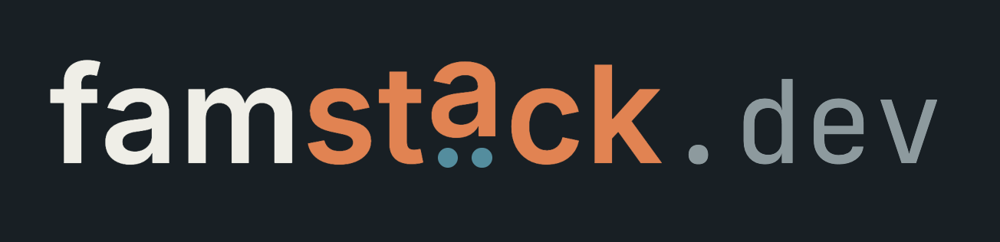
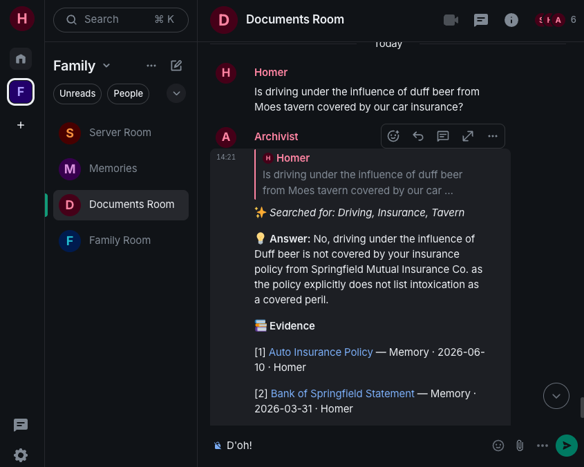
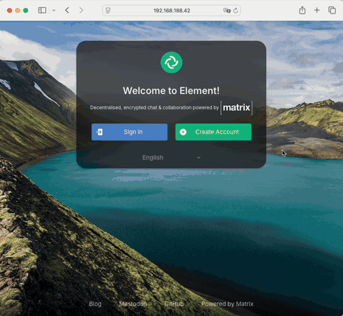

<p align="center">
  <a href="https://famstack.dev">
    
  </a>
</p>

<p align="center">
  <a href="https://famstack.dev"></a>
  <a href="https://discord.gg/hfutdmmfBe"></a>
  <a href="https://bsky.app/profile/famstack.dev"></a>
  <a href="https://x.com/arthwaredev"></a>
  <a href="https://www.youtube.com/@famstacker"></a>
</p>

<p align="center">
  
  
  
</p>

**The vision: Turn your Mac into the brain of your household and operate it from your phone.**
Photos, memories, documents, chat, local AI: local and private by default, gets smarter over time. Open source.

*"I built this because our photos, our voices, our documents: That's our life. It belongs on our hardware, not in someone else's cloud."*

The reference implementation runs on a Mac Studio M1 in our living room at Lake Constance, Germany. Where is yours going to run?
<br>

> [!NOTE]
> [**v0.3.0-beta.1**](https://github.com/famstack-dev/famstack/releases/tag/v0.3.0-beta.1) is the current Beta.
>
> The state of this project is: **It works on my machine.™**
> I gave my best it works on yours too. If it doesn't, come back and report it
> or join our [Discord](https://discord.gg/hfutdmmfBe).
> If it works: please share it. A star, a post, a mention. That's what keeps a project like this alive.

> [!TIP]
> **New in 0.3: your family server gets a memory.**
> The `memory` stacklet curates a wiki of your family life out of the documents, notes, and voice memos you drop in the chat. Browsable, searchable, Obsidian-compatible, on your own Mac. Ask a question in the chat and get an answer with sources.
> It's in daily use on our own server, first tagged as [`v0.3.0-beta.1`](https://github.com/famstack-dev/famstack/releases/tag/v0.3.0-beta.1). [Read the introduction](https://famstack.dev/blog/famstack-0-3-beta/).

## What you get today

- **Private family chat** with native iOS, Android, macOS, Windows and web apps (Matrix + Element X).
- **Photo library and mobile backup** that replaces iCloud Photos for the whole family (Immich).
- **Document archive with OCR** that you photograph from your phone and the local AI files for you (Paperless-ngx).
- **Your family wiki**: an Obsidian-compatible second brain, generated from the documents, notes, and voice memos you file (memory).
- **Local AI engine** on Apple Metal GPU: voice transcription, text-to-speech, document classification (oMLX + Whisper + Piper).
- **A bot runtime in chat** that automates the small stuff: filing receipts, transcribing voice memos, status reports.
- **One CLI to operate it all**: `./stack up <thing>` and it is running.

<p align="center">
  <video src="https://github.com/user-attachments/assets/9242ab58-2c0f-4fc2-bcc9-e7ce618caca8" width="280" controls muted></video>
</p>

<p align="center"><em>The archivist files and finds documents from your phone, in chat</em></p>


<p align="center">
  
</p>

<p align="center"><em>Ask the wiki a question in chat, get an answer with sources</em></p>


Everything runs on your Mac. Nothing leaves your network unless you tell it to.

## Quick Start

You need a Mac with Apple Silicon (M1+), [Homebrew](https://brew.sh), and [OrbStack](https://orbstack.dev) (or Docker Desktop). The installer guides you through anything that's missing. If your `python3` is Apple's Command Line Tools build (3.9), run `brew install python` first.

```bash
git clone https://github.com/famstack-dev/famstack.git && cd famstack
./stack         # Starts the Installer
```

The installer checks dependencies, sets up your data directory, and gets the nervous system running: Matrix and Element X. Once you log in to your private Element X, you operate the stack from your Server Room. Or your Terminal. From there, add what your family needs:

```bash
./stack up docs        # Paperless-ngx: document archive with OCR
./stack up ai          # Local AI: TTS, Whisper, oMLX
./stack up photos      # Immich: family photo library + mobile backup
./stack status         # check everything is running
```

Twenty minutes from clone to a working family server. The [Admin Guide](docs/admin-guide.md) covers install, stacklets, operations, and troubleshooting in detail. The [User Guide](docs/user-guide.md) is the page you send your family: what to type in chat and what comes back.

<p align="center">
  
</p>

<p align="center"><em>Then explore your stack in your family messaging</em></p>


<p align="center">
  
</p>

---

## Who This Is For

People who know what a Terminal is. Families that are interested in Tech. Families who are tired of uploading their kids' photos to servers they don't control. 
Parents who'd rather spend Saturday morning with their kids or tinkering rather than searching for a specific important document.
Families who want to take advantage of tech and store memories of their lives where it belongs: your home.

No Linux experience required, no Docker knowledge assumed. If you can run a shell command, you can run famstack.


## Why I Built This

I was manually copying photos off my phone with a cable. Like a caveman. 
Twenty years of automating things for businesses as a veteran software engineer, and my own family was running on drawers full of paper and a 15-year-old Synology NAS that hadn't seen an update in years.

Four weeks ago we started recording our kids' voices in a family chat room. 
Tiny moments, funny things they said, bedtime stories in their own words. 
We wished we'd started with our first son. Those memories would be gone forever. Now they're not.
They live on our own server, transcribed, searchable.

That's what this is. An open source stack that puts photos, documents, family memories and local AI on a Mac in your home. 
Private, no subscriptions, and no cloud provider that might shut down next year.
But it's not just archiving. The goal is a family operating system: something that remembers, organizes, and eventually runs the boring parts of everyday life for you. Think JARVIS, built one stacklet and bot at a time.

[Read more on the website](https://famstack.dev/why/).

---

## How It Works

famstack is composed of **[stacklets](docs/stack-reference.md)**: self-contained mini-stacks that snap together. 
Each stacklet is just Docker Compose, shell scripts, and a TOML manifest. No custom runtime. 
Convention over configuration and a small CLI gluing it together. It's just a convenience layer on top of existing
open source technologies. No lock-in. You don't need an eject button, because there is nothing to eject.

```
famstack/
├── stack                    CLI (single Python file, zero pip deps)
├── stack.toml               User configuration (domain, data dir, timezone)
└── stacklets/
    ├── core/
    │   └── stacklet.toml    Always-on infrastructure (Caddy, Watchtower)
    └── photos/
        ├── stacklet.toml    Manifest: identity, env config, health check
        ├── docker-compose.yml
        ├── setup.sh         First-run setup (idempotent)
        ├── caddy.snippet    Reverse proxy config
        └── .env             Auto-generated by 'stack up'
```

### .env is a derived artifact

I was quite annoyed with juggling a gazillion .env files and with secrets. So I fixed it.
One central configuration, one single source of truth. Everything else is just derived.

No manual `.env` editing. `stack up` generates it every time from three sources:

1. **stack.toml** for paths, domain, timezone
2. **stacklet.toml `[env.defaults]`** for templates like `{data_dir}/photos/library`
3. **.famstack/secrets.toml** for auto-generated passwords (created once, reused on re-up)

Change something in `stack.toml`, run `stack up` again, and the `.env` regenerates to match.

### Data

All persistent data lives in `~/famstack-data/<stacklet>/` (configurable) outside the repo. 
Each stacklet owns its subdirectory. `stack destroy` wipes it, so back up that directory separately.

---

## Stacklets

Each stacklet except core and messages is opt-in. You can mix and match them as you please.
Messages is optional in theory (But without it, the whole point of famstack is a bit neglected).
Messages allows you to operate the stack from your smartphone. 

famstack comes with a lightweight bot runtime. The bots are tiny helpers that automate tasks in your family chat: filing documents, transcribing voice memos, managing your stack. Experimenting with [nanobot](https://github.com/HKUDS/nanobot)-based agent bots too.

| Stacklet | Status  | Service                | What it does                                             |
|----------|---------|------------------------|----------------------------------------------------------|
| core     | working | Bot Runner, Watchtower | Reverse proxy and the famstack Bot runner                |
| messages | working | Matrix + Element       | The famstack central WhatsApp-like communication center. |
| photos   | working | Immich                 | Family photo library and mobile backup                   |
| docs     | working | Paperless-ngx          | Document archive with OCR                                |
| ai       | working | TTS, Whisper, oMLX     | Turns your Mac into an AI Machine                        |
| chatai   | beta    | Open WebUI             | ChatGPT-like chat interface                              |
| code     | beta    | Forgejo                | Private Git server                                       |

Want to add your own to your stack? [Creating a stacklet](docs/creating-stacklets.md) takes about 15 minutes.

---

## Roadmap

Document filing, photo backup, family chat with voice memos, and the family memory wiki all work today, first tagged as [`v0.3.0-beta.1`](https://github.com/famstack-dev/famstack/releases/tag/v0.3.0-beta.1) ([what landed in 0.3](https://famstack.dev/blog/famstack-0-3-beta/)).

| Feature                                                  | Status                       |
|----------------------------------------------------------|------------------------------|
| Photos (Immich)                                          | :white_check_mark: Live      |
| Document filing with OCR (Paperless)                     | :white_check_mark: Live      |
| Family chat + voice memos (Matrix)                       | :white_check_mark: Live      |
| Local AI backend (oMLX, Whisper, TTS)                    | :white_check_mark: Live      |
| Bot runtime (archivist-bot, scribe-bot, stacker-bot)     | :white_check_mark: Live      |
| Private Git server (Forgejo)                             | :white_check_mark: Live      |
| Family wiki generated from your documents (memory)       | :construction: 0.3-beta      |
| Document Q&A with citations, in chat                     | :construction: 0.3-beta      |
| Voice memos become searchable notes                      | :construction: 0.3-beta      |
| Topic rooms: the room name is the filing system          | :construction: 0.3-beta      |
| Nice domains setup e.g. `https://photos.home.domain.tld` | :construction: Beta          |
| Backups (backup stacklet, append-only to attached disk)  | :dart: Next                  |
| Bot interaction patterns (how a family talks to bots)    | :dart: Next                  |
| Dream cycle (vault consolidation, richer wiki pages)     | :dart: Planned               |
| Family memory bank (voice + photos matched by day)       | :dart: Planned               |
| Home Assistant                                           | :dart: Planned               |
| Talk to your Mac                                         | :dart: Planned               |
| Living room display (memories from this day, years ago)  | :dart: Planned               |

---

## Commands

The ones you'll use day to day:

```bash
./stack up <stacklet>      # start (idempotent)
./stack down <stacklet>    # stop, data stays
./stack status             # health overview: containers + host + AI
./stack logs <stacklet>    # tail logs
./stack errors             # recent error logs (past 24h)
```

The full reference (lifecycle, observability, AI, config) lives in the [Admin Guide](docs/admin-guide.md). All commands output JSON when piped; `--json` and `--pretty` force the format.

---

## Configuration

`stack.toml` is the single config file. Committed to your fork.

Each stacklet has a `stacklet.toml` in the root of the stacklet directory for stacklet-specific configuration.

```toml
[core]
domain   = "home.internal"     # wildcard DNS on your router, or empty for port mode
data_dir = "~/famstack-data"   # all persistent data (databases, uploads)
timezone = "Europe/Berlin"

[updates]
schedule = "0 0 3 * * *"       # Watchtower nightly image updates
```


## Docs

Everything lives in [docs/](docs/): the [User Guide](docs/user-guide.md), the [Admin Guide](docs/admin-guide.md), the [stacklet reference](docs/stack-reference.md), [creating your own stacklet](docs/creating-stacklets.md), and the [architecture decision records](docs/adr/).

## Contributing

famstack is young and shaped by daily family usage. The most useful contributions right now:

- **Run it and report.** A fresh install on hardware I don't have is worth more than code. [Open an issue](https://github.com/famstack-dev/famstack/issues) with what broke.
- **Build a stacklet.** [Creating a stacklet](docs/creating-stacklets.md) takes about 15 minutes. If it's useful for your family, it's probably useful for others.
- **Tell me what's missing.** Join the [Discord](https://discord.gg/hfutdmmfBe) and tell me what your family would actually need.

## License

[AGPLv3](LICENSE) — Copyright 2026 [arthware.dev](https://arthware.dev)

---

This code was created with the help of frontier AI. There is simply no other way for a family father as a side-project.
I refuse to call it vibe coded though. It took too long for a Vibe-Coded project.
I'd rather call it _AIssisted Engineering_. And I think that is the only right way to use AI for code that matters.
