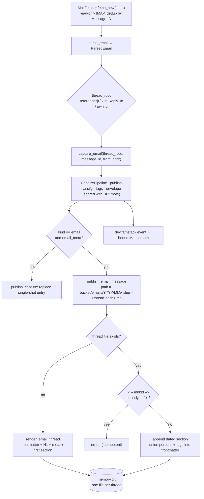

# Family Email Tools — design

> Status: design draft
> Created: 2026-06-20
> Target: ingestion ships independent of the agent; drafting rides on the
>   Family Agent runtime (agent v0.4, see [plan.md](plan.md))
> Depends on:
>   - [plan.md](plan.md) — the agent runtime + tool surface that drafting needs
>   - [../brain/family-memory.md](../brain/family-memory.md) — the vault shape email files into
>   - [../brain/knowledge-architecture.md](../brain/knowledge-architecture.md) — the event bus filings ride

## Goal

Bring family email into the Family Brain and let famstack do real work with it:

1. **Ingest** family email into the vault — searchable, classified, alongside
   documents and captures.
2. **Surface email in Matrix** — family email shows up in a Matrix room, with
   the room ↔ mailbox binding configured the famstack-native way (room state,
   set by the bot on invite).
3. **Derive tasks** from email (deadlines, forms to return, payments due).
4. **Draft replies** the agent composes from vault context; a human approves
   before anything is sent.

The constraint that shapes the whole design: **wire established components,
write as little new code as possible.** Two of the three layers above already
exist in the shipped brain; only drafting is genuinely new.

## The reframe: three layers, two already exist

Email is not a new subsystem. It is:

1. **Another ingestion source.** An email is structurally a document/capture:
   a body, a subject, a sender, a date. The archivist's classify→mirror
   pipeline already turns a `SourceContent` into a vault entry. Email points at
   the pipeline we already ship — it does not get its own brain.
2. **Tasks for free.** The classifier already extracts `action_items`
   ("deadlines, payments due, forms to return" — `pipeline.py` prompt) and
   renders them in the `> [!summary]` briefing. An email that says "send the
   form back by Friday" *already* becomes an action item. The only new bit is
   rolling those up into a tasks view — the same single-walk rollup the wiki
   and grocery list use.
3. **Drafting — the new capability.** Composing a reply is a tool call by the
   **Family Agent** (the layer designed in [plan.md](plan.md), not yet built).
   Drafting is low-risk; *sending* is the one privileged outbound action, and
   it is human-in-the-loop.

This is also the pattern `IDEAS.md` keeps arriving at independently (the
Mediathek note's "build a generic `cast_to_tv` tool, one tool many callers").
Email drafting is just another caller of the agent's tool surface.

## Wire, don't build: himalaya as the email surface

Don't write IMAP/SMTP/MIME. Wire **himalaya** (`github.com/pimalaya/himalaya`),
a mature CLI email client. Verified against its docs:

- Rust binary, **Homebrew-installable** (matches our Apple-Silicon install story).
- Backends: **IMAP, SMTP**, JMAP, Maildir.
- **`--json` output** on every command — machine-readable envelopes (id,
  message-id, flags, subject, from, to, date, attachments).
- Commands we need: `envelope list` / `envelope search`, `message read <id>`
  (raw RFC 5322 or JSON), `message add -m drafts` (save a draft), `message send`.
- OAuth2 via an external token broker; TOML multi-account config.

himalaya becomes the implementation behind a `stack mail` CLI. This preserves
the framework invariant **"the `stack` CLI is the sanctioned agent interface"**:
the agent calls `stack mail …` as a tool, exactly like every other capability.
We own the glue (config rendering, the email→`SourceContent` adapter, the
approve loop); himalaya owns the protocol.

### Email → the existing ingestion contract

`SourceContent` (verified in `extractors.py`) is `text` + `title_hint` +
`source_uri`. Email maps cleanly:

| `SourceContent` | from email |
|---|---|
| `text` | message body (`himalaya message read --json` → plaintext/markdown) |
| `title_hint` | subject |
| `source_uri` | `message-id` (stable, dedupe key) |

Feed that into the existing `CapturePipeline` path (it already has
`capture_url` / `capture_text` / `capture_binary`; email is one more
`capture_*` sibling) and an email becomes a vault entry with a `> [!summary]`
briefing and `## Action items` — no new intelligence written.

### himalaya contract (pinned against v1.2.0, not the README)

Pinned by running himalaya 1.2.0 against a fabricated local maildir. The README
was wrong on several points, so these are the real shapes:

- **JSON flag is `-o json`** (`--output {plain,json}`), *not* `--json`.
- **Maildir backend needs `backend.maildirpp = true`** or it can't resolve INBOX.
- **`envelope list -o json`** is a *bare array* (not `{"envelopes": […]}`), and
  carries **no Message-ID**:
  ```json
  [{"id":"2","flags":[],"subject":"…",
    "from":{"name":"…","addr":"…"},"to":{"name":null,"addr":"…"},
    "date":"2026-06-20 10:00+00:00","has_attachment":false}]
  ```
  `from`/`to` are single objects with **`addr`** (not arrays, not `email`); `id`
  is a maildir sequence number, **not stable** across syncs.
- **`message read <id> -o json`** returns a single JSON *string* of the rendered
  message, body wrapped in himalaya MML (`<#part …>BODY<#/part>`). Awkward, and
  there is no `--raw`.

**Decision: ingestion does not parse himalaya's JSON at all.** himalaya's job is
IMAP↔Maildir transport (and SMTP send). The Maildir it produces is plain
**RFC822**, so the mail bot reads the message files directly with Python's
stdlib `email` module — clean Subject / From / Message-ID / Date / body, the
stable cross-sync key (Message-ID) included. himalaya's `envelope list -o json`
is used only by the human `stack mail list` CLI. This keeps the ingestion parser
on a standard (RFC822 + stdlib) instead of himalaya's rendering quirks, and it
is fully unit-testable with fabricated `.eml` strings.

**Transport caveat — himalaya has no IMAP→Maildir sync in the homebrew build**
(`+imap +smtp +maildir`, no sync feature; `account sync` is absent). So himalaya
alone cannot populate the Maildir. Options, all behind the same Maildir seam:

- **mbsync/isync** — the gold-standard IMAP→Maildir sync, in the `mail` container.
  himalaya then handles only SMTP send + the `stack mail` CLI.
- **stdlib `imaplib`** — the bot fetches new messages by UID/Message-ID directly,
  no external sync tool, no Maildir even. Simplest and most testable, but puts
  IMAP creds + external network in bot-runner (less isolated than a `mail`
  container).

This is the swappable-transport property in action: the **Maildir (or just
RFC822 bytes) is the integration seam**; himalaya/mbsync/imaplib/msmtp are
interchangeable behind it, and `parse_email`/`capture_email` never change.
himalaya is mature (6.4k★, homebrew-core, active, v1.2) but single-maintainer;
the seam means that bus-factor is not our exposure. Decision between mbsync and
imaplib is deferred to the A2 build (the GreenMail round-trip informs it).

## Architecture

**Two roles, split on the credential boundary.** One component talks to the
mail server; the component that writes your vault never sees a password.

- **mail bot** (holds IMAP/SMTP creds, network-facing, runs in the `mail`
  container with egress scoped to the mail host): fetches new mail, strips the
  quoted history off replies (`email-reply-parser`), and posts each message
  into the bound Matrix room as a threaded event. Sends approved drafts back
  out via SMTP. It *can* talk for its own configuration (the bind-on-invite
  question, account setup) like any bot; the invariant is not silence, it is
  **credential isolation**: it is the only component that touches the mail
  server. Day to day the family interacts with the archivist, not it.
- **archivist** (no mail creds, bot-runner): sees the posted message,
  classifies, folds it into its thread file, files to the vault, emits
  `dev.famstack.event`. Identical to what it already does for a pasted URL or
  note. Email adds no new pipeline; it adds one recognized message shape.

The Matrix room is the handoff, the durable source of record, and the
family-visible surface at once. This **drops the shared-Maildir volume** the
earlier draft used: no shared filesystem, no IMAP-reading code in the
archivist, and the email arrives as a first-class room message instead of a
silent file plus a separate notification. `stack mail …` wraps `docker exec`
into the gateway for send and status.

### Email thread maps to a Matrix thread

postmoogle (the reference bridge) folds an email thread onto a native Matrix
thread and exposes three switches worth mirroring: `threadify` (the message
body lives in the thread, not the room timeline), `nothreads` (off switch),
and `stripify` (drop quotes + signatures, their reply-parser). We do the same:

- One **root message per conversation** sits in the room timeline (subject +
  sender + briefing). The room stays one line per thread, not N.
- Each later message is a **threaded reply** (`m.thread`, keyed by
  `thread_root`). The thread holds the conversation; the timeline stays calm.
  Flood solved, the way the reference implementation solved it.
- The archivist reads the `m.thread` relation to know which vault thread file
  the message folds into, reusing the fold already shipped.

### Every ingested message is twofold

A message the archivist ingests carries two faces on one event: the rendered
view the family reads, and the raw original the machine re-derives from. The
gateway is the first producer of this shape; every ingest source should adopt
it.

    m.room.message {
      msgtype: "m.text",
      body:    "<rendered, human-readable, derived from the original>",
      "dev.famstack.source": {
        source:      "email",            // email | note | url | scan | ...
        raw_content: "<verbatim original payload, pre-render>",
        // source-specific descriptors:
        from:        "office@springfield-school.example",
        message_id:  "<reply@school.example>",
        thread_root: "<root@school.example>",
        captured_at: "2026-06-21"
      }
    }

- `body` is the nice view: always present, always derived from the original.
- `raw_content` is the **reproducibility anchor**. Re-folding and reprocessing
  read it, never re-fetch IMAP (ADR-010). Naming the field closes the
  reproducibility gap from the threading section: today `reprocess` re-feeds
  the model its own prior summary, which is lossy; with `raw_content` it
  re-reads the real source.
- the source block lets each inbound type add its own descriptors (email:
  from / message_id / thread_root; a future scanner: device / page count)
  with no schema change.

Classification still produces the existing `dev.famstack.event` filing
envelope (`{source, type, summary, data}`). `dev.famstack.source` is the raw
input that envelope is derived from, not a replacement for it.

### Plumbing lives in the bot framework (MicroBot)

None of the above is email-specific code. Posting a twofold message,
threading it under an `m.thread` root, stamping `dev.famstack.source` with
`raw_content` + per-source fields, and recognizing such a message on the way
in are all **framework concerns**, not bot concerns. They belong in `MicroBot`
(`stacklets/core/bot-runner/microbot.py`), whose `_send(metadata=…)` already
carries custom keys onto the visible message. The mail bot and the archivist
are both `MicroBot` subclasses; the gateway calls a framework helper to *post*
a source event, the archivist a framework hook to *consume* one. A future
ingest source (a scanner, a webhook) subclasses the same framework and gets
the twofold shape for free. No per-bot copy of the wire format.

```
  IMAP / SMTP mailbox
     │  mail GATEWAY  — mail CONTAINER (only network-facing piece; holds creds)
     │  fetch → reply-parse (strip quotes) → post; SMTP send for approved drafts
     ▼
  Matrix room   (handoff + durable source of record + family-visible surface)
     │  posts m.room.message: body = rendered,
     │     dev.famstack.source = {raw_content, from, message_id, thread_root, …}
     │  email thread → m.thread (root in the timeline, replies in the thread)
     ▼
  archivist (bot-runner, NO mail creds)
     │  recognizes dev.famstack.source → classify → fold → file to vault
     ▼
  vault entry: <bucket>/emails/YYYY/MM/<slug>-<thread-hash>.md   (type: email)
     │  folded by thread_root; action items extracted per message
     ├─ emits dev.famstack.event (capture.filed) on the timeline
     └─ tasks rollup (deriver/wiki pattern) → <vault>/tasks.md

  Family Agent runtime (agent v0.4, restricted container)
     ├─ reads:  vault (incl. the email + related facts)        :ro
     ├─ tool:   stack mail draft / stack mail send
     └─ LLM:    local (oMLX), no cloud
     │  composes a reply → posts the draft into the thread
     ▼
  Human reviews in Matrix → approves → `stack mail send <draft-id>`
     → gateway → SMTP
```

### Attachments: the whole message, not just the body

`raw_content` (scoped to email for now) holds the verbatim text body, but an
email is body **plus attachments**, and the body alone is not the whole
message. So the mail bot posts each attachment into the room as a normal
Matrix media event (`m.file` / `m.image`) in the **same thread** as the text.
"The whole message" is then the text event plus its sibling media events,
co-located under one `m.thread`.

The win: attachments ride a path the archivist **already has**. `_on_file`
(`archivist.py`) routes `m.file` / `m.image` uploads through the
DocumentPipeline and `capture_binary` today, so an emailed PDF (a school form,
an invoice) lands in Paperless exactly as a dragged-in file would, and an image
lands in the vault. No new attachment code. The email thread file and the
resulting document correlate by living in the same Matrix thread.

One real concern to settle when we build this, not now: **not every attachment
is signal.** Sender-signature logos, inline tracking pixels, and tiny images
would flood Paperless and the room with junk. The bot needs an attachment
filter (skip below a size threshold / inline-disposition images), and an
on/off toggle, the way postmoogle exposes one. Body text is unaffected; this
is purely about which binaries get pasted.

## Routing email into Matrix rooms

Family email should *appear in Matrix* — in the room the family chose for it —
not just file silently into the vault. famstack already has the exact
mechanism: topic rooms bind a room to intent via a **`dev.famstack.capture`**
room-state event carrying a `kind`, and the bot welcomes itself + bootstraps on
join (`topic_rooms.make_room_state`, `archivist._send_room_welcome_if_needed`).
The state schema already anticipates kinds beyond `topic` (the documents-room
binding, "future" kinds). Email is one more kind on the same rails.

**The binding is room state, set by the bot — not static `stack.toml`.** This
matches the topic-rooms pattern and the self-explaining-UX rule (bots configure
on invite, not via a config file the family never sees). Split of
responsibilities:

- **Credentials** (per-account IMAP/SMTP) live in config + the secret store —
  himalaya's multi-account TOML, rendered from `stack.toml` + secrets. This is
  machine config, not room state.
- **The room ↔ (account, folder) binding** lives in `dev.famstack.capture`
  room state with `kind: "mailbox"`, `{account, folder}`. Set by the mail bot
  when invited to a room.

### Bind-on-invite flow (mirrors topic rooms)

1. A family member creates a room (e.g. `#Post` or `#Schule`) and invites the
   mail bot.
2. The bot joins, **introduces itself** (existing welcome path), and checks for
   a `dev.famstack.capture` mailbox binding.
3. If unbound, it asks the one question it needs: *which account and folder
   route here?* (e.g. `family@… / INBOX`, or `family@… / Schule`). Answered by
   a short reply or a `bind <account> <folder>` command.
4. The bot writes the room-state binding. From then on, mail in that
   (account, folder) posts to that room.

One account's folders can fan out to different rooms (INBOX → `#Post`, a
"Schule" label → `#Schule`); the binding is per-room, so it composes.

### How a message reaches the room

The **gateway** fetches IMAP, resolves the `(account, folder)` to a bound room
via the `dev.famstack.capture` binding, and posts the message there: a rendered
`body` plus the `dev.famstack.source` block (`raw_content`, `from`,
`message_id`, `thread_root`), threaded under the conversation's root. That post
*is* the source of record. The **archivist** then does what it does for any
room message: classify, fold into the vault thread file, and emit
`dev.famstack.event` back onto the timeline. The gateway routes (it knows the
binding and holds the creds); the archivist files (it holds no creds). Because
the room is bound, a reply in it ("draft an answer", "remind me Friday") is
scoped to that mailbox, reusing the topic-rooms reply-chain pattern.

## Vault layout, threading, and processing

### Paths and bucket

`<bucket>/emails/YYYY/MM/<slug>-<hash>.md` — the capture shape (`<entity>/<kind>s/…`,
kind `email`), already produced by `capture_email`. The **bucket comes from the
room binding, not hardcoded**: a shared family mailbox files to `family/emails/…`
(institutional, like documents); a person's account files to `<person>/emails/…`
(personal, like their captures). Default = the bucket that owns the account.

**Merge by date, do not subfolder per inbox.** Account + folder live in
frontmatter (and the room binding), not as a path level — consistent with the
rest of the vault, where identity is frontmatter + date path and the channel is
never a directory. Two inboxes to the same bucket merge on disk but stay distinct
rooms + distinct frontmatter; dedup by Message-ID keeps it safe.

### Threading: one file per thread, folded (per ADR-010)

An email thread *is* a reply chain, and [adr-010](../adr/adr-010-event-pipeline.md)
already says a filing's source is the whole thread and the vault entry is the
*fold* of it. So:



The fold rules:

- **Key the entry by the thread root, not the message** — resolved by
  `ParsedEmail.thread_root` (`References[0]` → `In-Reply-To` → own Message-ID).
  `email_to_source` keys the vault entry's `mid:` URI off the thread root, so
  every reply resolves to the same file. (Shipped.)
- **Each new message appends a dated section** — `publish_email_message` reads
  the thread file, appends `## YYYY-MM-DD · sender` with the message's own
  briefing (summary, facts, action items) and the verbatim body, and writes it
  back. Persons and tags **union** into the thread's frontmatter so indexing
  spans the whole conversation. (Shipped.)
- **Idempotent by construction** — each section carries an HTML-comment
  `<!-- mid:<message-id> -->` marker; folding a message whose marker is already
  present is a no-op. The file itself records which messages it contains, so a
  re-run never double-files even before the fetcher's seen-set persists. The
  vault is the source of truth (ADR-010), not a side cache. (Shipped.)
- **Reproducible**: re-fetch every message in the thread by Message-ID, re-fold.
- **Append vs. correct** — both are "reply chains" but mean different things: a
  real inbound email *appends* (routes through `publish_email_message`, carrying
  per-message `email_meta`); a Matrix reply from a family member *corrects* the
  filing (a rewrite via `reprocess`). The presence of `email_meta` is what
  distinguishes them, so a human correction is never folded as a new email.

Staged status: thread-keying, per-message append, frontmatter union, and the
idempotency marker are **shipped**. Still to iterate: a *thread-level* rolled-up
summary (today each message keeps its own briefing), folding action items into a
single thread checklist, and wiring email `reprocess` to re-fold the whole
thread.

### Summary gate for short mail

Email runs the same classifier as everything else (title, summary, facts,
action_items, tags). But a two-line mail does not need an LLM summary — it would
be longer than the mail and waste a model call. So:

- **Always keep the email body** (unlike a bookmark; the body *is* the content).
- **Gate the summary on length** — below ~a few hundred chars, skip the
  `> [!summary]` briefing; the body stands alone.
- **Still extract action_items + tags when short** — cheap and the highest-value
  bit ("send the form back Friday" is short but actionable). Short ≠ no
  processing; short = *no summary*.

## What we reuse vs. build

**Reuse (no new code):**
- The classify pipeline + `action_items` extraction.
- `vault_entry` / `mirror_format` rendering and the OKF-conformant frontmatter.
- The `dev.famstack.event` bus (`build_capture_event`).
- The single-walk rollup pattern (wiki/grocery) for the tasks view.
- The **`dev.famstack.capture` room-state binding** + the bot's welcome /
  bind-on-invite path (`make_room_state`, `_send_room_welcome_if_needed`) — add
  a `kind: mailbox`, don't invent a new config surface.
- `stacklets/core/tools-server/` as the host for the agent's `mail` tool.
- himalaya for *all* email I/O.

**Build (small, additive):**
- A thin **email→`SourceContent` mapper** + a `capture_email` entry on the
  pipeline. Pure, fully unit-testable now — *slice A1*.
- A small **`mail` container** running himalaya (egress scoped to the mail host,
  creds from secrets, Maildir on a shared volume), plus `stack mail` wrapping
  `docker exec` (sync/list/read/draft/send) and rendering himalaya's TOML config
  from `stack.toml` + secrets — *slice A2, needs the binary + a test account*.
- A **mail bot** in bot-runner (MicroBot, beside the archivist — *not* the agent
  runtime): reads new Maildir messages, runs `capture_email`, binds rooms on
  invite (`kind: mailbox` room state) and routes filings to the bound room.
- A tasks rollup page (needs `_index_vault` to also surface `action_items` — it
  currently captures summary/persons/topics/tags but not action items; small
  extension).
- The `draft_email` / `send_email` agent tool — on the chosen runtime, once the
  agent Phase 0 spike picks one.

## The `stack mail` contract (agent-facing)

Stable exit codes, `--json` output, idempotent — the same contract every
agent-callable command honors.

| Command | Does | Outbound? |
|---|---|---|
| `stack mail sync` | fetch new IMAP mail to Maildir, hand new messages to the classify pipeline; dedupe by `message-id` | no (read) |
| `stack mail list [--json] [--query …]` | envelope list / search | no |
| `stack mail read <id> [--json]` | message body | no |
| `stack mail draft --to … --subject … --in-reply-to <id> --body-file …` | save a draft (himalaya `message add -m drafts`); never sends | no |
| `stack mail send <draft-id>` | send a saved draft over SMTP | **YES — gated** |

## Drafting: the safe loop (no autonomous send)

1. Agent composes a reply from vault context (the thread + cited facts).
2. `stack mail draft` saves it to the Drafts folder.
3. Agent posts the draft text into Matrix for review, with citations.
4. A human edits/approves.
5. `stack mail send <draft-id>` sends it.

No autonomous outbound. This matches [plan.md](plan.md)'s posture (restricted
container, local LLM, no cloud calls) and German trust norms (a machine sending
mail unsupervised is a non-starter). SMTP credentials live in the secret store
and are injected only into the `mail` container's env; nothing else can read
them, and the container's egress is scoped to the mail host.

## Sequencing

- **Phase A1 — the pure core (no binary, no mailbox, no rig).** The
  email→`SourceContent` mapper + `capture_email` on the pipeline, fully
  unit-tested with fabricated inputs. Proves the ADR seam (does email slot into
  `SourceContent` cleanly?) and is mergeable on its own.
- **Phase A2 — ingestion + Matrix surfacing.** The `mail` container (himalaya) +
  `stack mail sync/list/read` + the mail bot (reads Maildir → `capture_email`,
  bind-on-invite room state, routes filings to the bound room) + tasks rollup.
  Needs himalaya installed + a test account; pins the `message read --json`
  body schema against the live binary. Uses the *existing* MicroBot/room-state
  machinery, not the agent runtime. Ships standalone value: family email appears
  in the right Matrix room, searchable, with tasks extracted.
- **Phase B — agent runtime.** The [plan.md](plan.md) Phase 0 spike (nanobot
  vs pi), run against the **email-draft flow** as the concrete test instead of
  generic Q&A.
- **Phase C — drafting.** `draft_email` / `send_email` tools on the chosen
  runtime, plus the approve loop above.

Phase A is independent and immediately useful; Phase C is the "agent does real
work" milestone and depends on the runtime.

## Invariants / safety

- **All email protocol work goes through himalaya.** No handwritten IMAP/SMTP/MIME.
- **Local LLM** for classification and drafting. No cloud.
- **Ingestion is read-only on the mailbox by default.** Track ingested
  `message-id`s in a cache (like the mirror cache) rather than mutating server
  flags, unless the user opts into mark-as-seen.
- **Sending is the only privileged action** — human-approved, credentials
  isolated to the host, never in the agent container.
- **Never file into the vault without classification** — consistent with
  documents and captures; an email gets the same briefing + privacy bucket.
- **Idempotent sync** — re-running `stack mail sync` never double-files
  (message-id dedupe), same discipline as document reprocess.

## Open questions

1. **Account model.** One shared family mailbox, or per-person accounts?
   Per-person routes naturally to per-person buckets (like captures by sender).
2. **What to ingest.** All mail floods the vault with newsletters/receipts. A
   himalaya `envelope search` filter, an allowlist, or a cheap "is this worth
   filing?" classifier gate? Lean toward a gate so the vault stays signal.
3. **Tasks surface.** A dedicated `tasks.md` rollup, per-person task lists, or a
   Matrix `what's on my plate?` query answered live from `action_items`?
4. **Drafting context budget.** How much vault context feeds the draft LLM?
   Start minimal — the thread plus explicitly cited facts.
5. **Stacklet boundary.** RESOLVED. A `mail` container owns the network-facing
   himalaya (creds, scoped egress); the classify/file/route logic reuses the
   docs pipeline via a mail bot in bot-runner (shared Maildir handoff). Not a
   host stacklet (no host-resource need; isolation wanted), not a fork of the
   docs pipeline (reused).
6. **Bidirectional rooms?** A bound room shows incoming mail; should *posting*
   in it (or a reply-chain) be able to *send* mail too (via the human-approved
   `stack mail send`)? Natural, but it couples Phase A's bot to Phase C's
   drafting — keep read-only in Phase A, revisit once drafting exists.
7. **Binding UX.** Free-text question-and-answer on invite, a `bind <account>
   <folder>` command, or a room-name convention like topic rooms' `Thema:`
   prefix (e.g. `Post:`)? Account+folder is hard to encode in a name, so lean
   on the bot setting state from a short reply.
