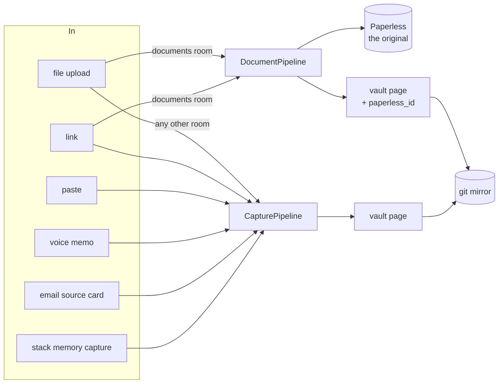
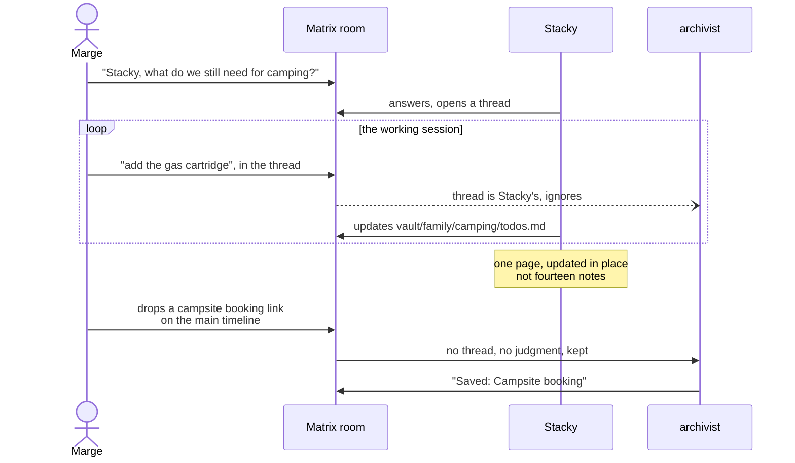

# What happens to something you want kept

> Status: Map of what exists, plus a proposed direction for the agent's part
> Created: 2026-08-06
> Related: [who-answers.md](who-answers.md) (which bot acts at all), [write-layer.md](write-layer.md) (findings 5, 12, 14, 15), [interaction-patterns.md](interaction-patterns.md)

## Two use cases, and why they stay separate

**Document filing** is for an artifact you must be able to produce again.
A scanned passport, an invoice, a school permission slip. The bytes are
the point. Paperless is the system of record: it keeps the original,
OCRs it, and gives it a durable numeric id.

**Notes and bookmarks** are for something you want to recall. A pasted
list, a link, a voice memo, a line from an email. There is no original to
retain; the meaning is the whole thing. A markdown page in the vault
carries it, classified and attributed, versioned by git.

The test is one question: *would I ever need to produce the original?*
Passport, yes. "Bart has a peanut allergy", no.

Both paths end in the vault. Only one also ends in Paperless, and the
vault page it writes carries `paperless_id` back to the original. That is
the entire difference in storage, and it is worth keeping. Everything
else that differs between the two is accident, not design.

## The paths as they are

| | Document filing | Notes and bookmarks |
|---|---|---|
| **Trigger** | a file or URL in the documents room; a `(` … `)` scan session | a paste, a link, an image or PDF outside the documents room, a voice memo, an email source card, `stack memory capture` |
| **Pipeline** | `DocumentPipeline` (`stacklets/docs/bot/document_pipeline.py`) | `CapturePipeline` (`stacklets/docs/bot/capture_pipeline.py`) |
| **Storage** | Paperless, plus a mirrored vault page | a vault page, e.g. `homer/notes/2026/08/peanut-allergy-3a338e.md` |
| **Identity** | `paperless_id` (int) | vault path |
| **Enrichment** | correspondent, document type, tags, title, date | title, summary, tags, topics, persons, action items to todos |
| **Correction** | reply in the filing thread, `reprocess(doc_id, hint)` | reply in the filing thread, `reprocess(vault_path, hint)` |
| **Envelope** | `document.filed` / `document.reclassified` | `capture.filed` / `capture.reclassified` |

The shape of that picture is right. Two ways in, one of which also keeps
the bytes. The problem is not here.

## What is actually wrong

Two things, and neither is the split above.

**The grain is per message.** A conversation that produces one packing
list produces fourteen notes. write-layer finding 5 recorded it happening:
six re-posts of the same list became six notes and six extractions. The
archivist sees one message at a time and has no concept of "these belong
together", so it cannot produce one artifact from a working session.

**The judge is the message shape.** Whether something is kept is decided
by whether it is a bare URL, has a URL in it, or is at least 100
characters long. That decision is made with strictly less information
than anyone in the room has, which is why it produces both silent drops
and filed cookie banners.

Nobody in the room has that problem. A participant knows the list is
finished and knows it is the same list as before.

## The direction: the thread is the unit of judgment

Stacky is a participant. Inside a conversation it is already reading
every turn, so asking it "has this produced something worth keeping" is
close to free, and it is the only component that can answer.

That maps exactly onto the ownership rule already in force
([who-answers.md](who-answers.md)):

- **A thread with Stacky is Stacky's.** It reads the turns anyway. When
  the work is done it files or, better, *updates* one artifact through
  the capture door. The archivist does not touch that thread.
- **The main timeline is the archivist's inbox.** Unconditional, no model
  judgment, nothing lost. Drop a receipt, a link, a paste, and it is
  kept.
- **Files and the documents room stay the document path**, unchanged.

The two-tier shape is the load-bearing part. Letting a model decide what
is worth keeping is only safe when the fallback is "kept anyway, just not
consolidated". A single-tier design where Stacky is the sole judge turns
every model failure into a silent, unrecoverable loss, which is the one
failure mode famstack cannot afford: nobody ever finds out that the thing
they typed was never kept.

## What Stacky needs

Less than it looks, and one of the three is a bug fix that stands on its
own.

1. **The capture door.** `stack memory capture` already exists and is
   explicitly "the same pipeline the archivist runs, not a second way
   in". It is not in the agent's skill. So today the agent writes vault
   pages with `write_file`, which skips classification, tags, summary,
   attribution and the mirror. Two write doors with different guarantees
   is the split-brain to close first, independent of everything else
   here. **~1h.**

2. **A consolidation instruction.** At the end of its own turn, decide
   whether the conversation has produced something durable, and if so
   *update the page* rather than append a note. Updating is what makes it
   idempotent, and idempotence is what kills the six-notes problem.
   `vault_write.py` was built for exactly this. **~3h, mostly prompt.**

3. **Nothing else.** In particular:

**Stacky should not get the document path.** A file upload is already
unambiguous, so there is no judgment to add, and Paperless is the one
store where a wrong write is expensive. It keeps read access
(`stack docs show <id> --content`, which it already has) and files
nothing. Handing it a filing tool would be scope for its own sake.

## What this deletes

If the thread carries the judgment and the timeline is unconditional,
the shape tier in `_on_text` has nothing left to decide: `_is_just_url`,
`_first_url`, `looks_like_paste` and the `else: ignored` branch all
collapse into "a human posted on the main timeline, keep it". That is
four branches and the entire class of silent-drop bug.

Not proposed for today. It is the payoff that makes the direction worth
taking, and it should follow the week of real use, not precede it.

## Open questions

1. **When does Stacky decide it is done?** Per turn is cheap but chatty.
   End-of-conversation needs a timer, and there is no natural end to a
   family chat. Explicit ("save that") is reliable and puts the work back
   on the family. Start with per-turn and idempotent updates, since a
   wrong "yes" costs a rewrite of a page that keeps its history anyway.

2. **Where does capture live?** finding 14: `capture_pipeline.py` is in
   the docs stacklet and writes no Paperless document. It is a memory
   concern wearing a docs coat, and its one docs dependency is
   `paperless.get_tags()` for the person roster.

3. **Two answerers, still.** The archivist's search and the agent's
   `memory_search` both answer questions, and `stack docs search` does not
   exist (finding 12). Out of scope here; noted so it is not rediscovered.

4. **Rooms without Stacky.** The two-tier design assumes the archivist's
   unconditional timeline capture stays. It does. But a family that never
   invites Stacky gets tier one only, and that has to remain a complete
   product on its own.
