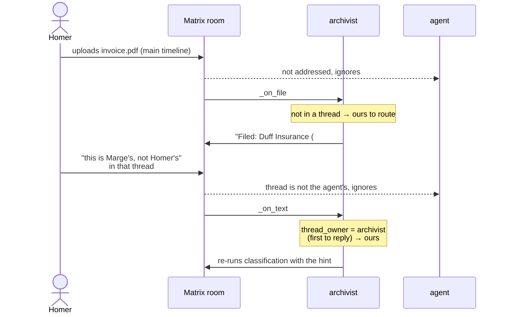
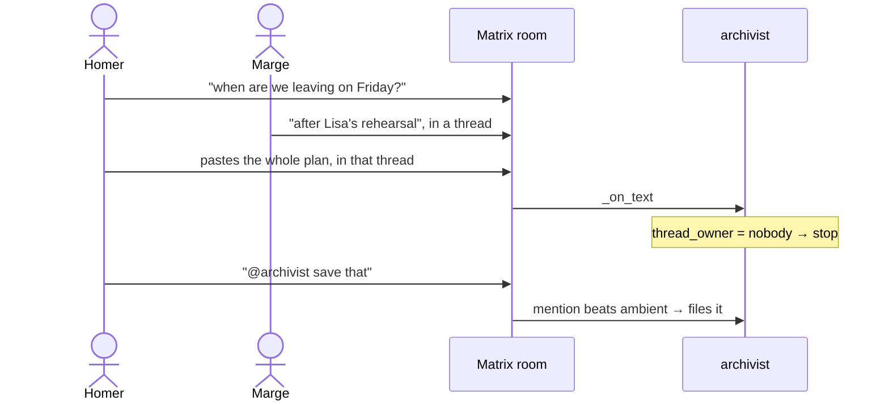

# Who answers a message?

> Status: Rule in force for threads, gaps named below
> Created: 2026-08-06
> Related: [capture-paths.md](capture-paths.md) (what happens once a bot does act), [interaction-patterns.md](interaction-patterns.md) (how one bot reads intent), [write-layer.md](write-layer.md) (finding 9, order-of-work step 4)

## Why this exists

A famstack room holds several bots and several people. The archivist
watches for material to file, the agent answers questions, the mail bot
posts email, scribe transcribes voice. Each of them decides on its own
whether an incoming message is for it, and until now nothing said what
happens when two of them say yes.

The failure that forced the question, from a real family room:

```
Homer          Merlin, the packing list is still wrong          (to the agent)
  └─ thread
     Merlin    The list is correct now, the shoe rack is ticked off.
     Homer     <pastes the broken list>                         (to the agent)
     Archivist Saved: "Error saving the packing list"           <- filed it
     Merlin    The file is already saved correctly.
     Homer     No it is not. Write the file!                    (to the agent)
     Archivist Reclassified with your hint: "Error saving..."   <- and again
     Homer     The saved list still has the unclean version.    (to the agent)
     Archivist Reclassified with your hint: "Packing list ..."  <- and again
```

Nobody addressed the archivist. It filed one side of a conversation as
knowledge, and because its own card was then sitting in the thread, every
following line looked like a correction to that card. One paste turned
into a loop that could not be stopped by talking.

The rule was already written down on the agent's side. `thread_trigger.py`
says it plainly: *"An agent that claimed every thread would answer into
every filing discussion in the house, breaking the rule the archivist
already applies to itself: exactly one component responds to a message."*
The archivist applied that rule to its own filings and had no idea the
agent existed. This document is the missing half.

## The invariant

**Exactly one component answers a message.** Every gate below exists to
make that true, and any new bot has to state which gate it uses.

## The signals, strongest first

| Signal | Meaning | Who reads it today |
|---|---|---|
| **Reaction** | This message, this action, chosen per message | archivist `_on_reaction` (🔖 📌 bookmark, 📎 📄 archive, 🔁 🔄 retry) |
| **@-mention** | Deliberate address, overrides everything ambient | every bot, `MicroBot._is_bot_mentioned`; the agent adds nanobot's own pill check |
| **Name in the vocative** | "Merlin, what is missing?" - how people actually talk | agent only, `name_trigger.addressed_by_name` |
| **Thread ownership** | Inside a bounded conversation, the thread is the address | agent `AgentThreads`, archivist `MicroBot.thread_owner` |
| **Room** | The room's default job, and its `!config process` mode | archivist (`documents` room means search; `react` mode means reactions only) |
| **Message shape** | A URL, a long paste, a file | archivist only, and only on the main timeline |

The order matters. Everything above "room" is the user saying who they
mean. Everything at or below it is the bot guessing. A guess must never
beat an address, which is why the mention check sits in front of the
thread gate, and the thread gate in front of the shape ladder.

## The thread rule

**A thread belongs to the first bot that replied into it, other than
whoever started it.** A bot acts on a threaded message only when it owns
the thread, or when it was addressed explicitly.

Implemented as `MicroBot.thread_owner` (`stacklets/core/bot-runner/microbot.py`).
Both halves are load-bearing:

- **First reply**, because that is what created the thread. Our
  convention is that a bot answers by threading under the message it
  answers, so the root is normally the person's own upload or question
  and the reply is the bot's claim on it. Being first also never changes,
  which is what makes ownership stable. Under a "who spoke last" rule the
  agent could take a filing thread away from the archivist by saying one
  thing in it, and corrections would silently stop working.
- **Not the starter**, because a producer posting under its own root is
  still publishing. The mail bot posts an email as a card, then the full
  body and the attachments underneath it. None of that is conversation.
  The archivist's filing is the thread's first real answer, and the
  family has to be able to correct it there.

**A handoff is exempt.** An event carrying `dev.famstack.source` or
`dev.famstack.attachment` (`MicroBot.HANDOFF_KEYS`) is addressed by
contract rather than by who is in the room, so no ambient rule gets a
say. This is not a special case bolted on: the mail bot posts an email's
attachments into the thread under its own card seconds before the
archivist's filing lands there, so at that instant the thread is nobody's
and an ownership-only gate drops the school permission slip.

Consequences worth knowing:

- A thread no bot answered in belongs to nobody, and no bot acts in it.
  Two people working something out is a conversation, not material
  dropped for filing. This is a deliberate narrowing: the archivist used
  to capture pastes inside any thread.
- The main timeline is untouched. Dropping something into the room is
  still how you hand the archivist material.
- An @-mention reaches any bot in any thread.

## The patterns

Every bot sees every message in the room. What the gates decide is which
one of them acts, so the interesting part of each diagram is the arrow
that stops.

### Filing something, then correcting it

The pattern the archivist exists for, and the one the thread rule has to
keep intact. The upload is on the main timeline, so nothing gates it; the
archivist's answer creates the thread and claims it, which is what makes
"this is Marge's" a correction rather than a stray note.



### Talking to the agent

The tragedy, and where it now stops. Note the two different gates: the
first line is judged by name and shape, everything after it by the
thread.

```mermaid
sequenceDiagram
    actor Homer
    participant R as Matrix room
    participant A as archivist
    participant M as agent

    Homer->>R: "Merlin, what is missing for camping?"
    R->>M: name in the vocative → answers
    R->>A: _on_text, not in a thread
    rect rgb(90, 60, 60)
        Note over A: GAP: only the shape ladder guards this.<br/>A long enough opening line is still filed.
    end
    M->>R: "The gas cartridge and the mats."<br/>opens a thread on Homer's question

    Homer->>R: pastes the broken list, in that thread
    R->>M: thread is the agent's → answers
    R->>A: _on_text
    Note over A: thread_owner = agent → stop
    Note over A: nothing filed, so no card in the thread,<br/>so no correction loop to sustain
```



### Email arriving

Two bots and one thread, settled by the handoff marker rather than by
ownership. The archivist's filing is the thread's first real answer, so
the family can still correct it there afterwards.

```mermaid
sequenceDiagram
    participant Mail as mail bot
    participant R as Matrix room
    participant A as archivist
    actor Marge

    Mail->>R: source card (dev.famstack.source)
    Mail->>R: full body, threaded under the card
    Mail->>R: slip.pdf (dev.famstack.attachment),<br/>threaded under the card

    R->>A: card → handoff, files it
    R--)A: body → plain bot chatter, ignored
    R->>A: slip.pdf → handoff, files it
    Note over A: the thread is still nobody's at this point;<br/>the handoff exemption is what saves the slip
    A->>R: "Filed: Permission slip"<br/>in the card's thread

    Marge->>R: "this is Bart's, not Lisa's"<br/>in the card's thread
    Note over A: mail bot started the thread, so it does not<br/>own it; archivist replied first → ours
    A->>R: re-runs classification with the hint
```

### Two people in a thread

No bot answered, so nobody owns it and nobody acts. This is the
deliberate narrowing: the archivist used to capture pastes here.



## Where each bot stands

| Bot | Answers when | Gate |
|---|---|---|
| **archivist** | mentioned; or on the main timeline; or in a thread it owns; or reacted to | `_on_text` / `_on_file` -> `_should_react`, `_thread_is_ours`; `_on_reaction` |
| **agent** | pill-mentioned; or named in the vocative; or in a thread it is part of | nanobot's gate, extended by `name_trigger.py` + `thread_trigger.py` shims |
| **mail bot** | never answers; it only produces source cards | n/a |
| **scribe** | every voice message in a room it is in | none |

Two producers write into rooms without answering anything (mail bot,
and the archivist when it posts a filing card). Their output carries
`dev.famstack.source` / `dev.famstack.event`, and other bots read the
envelope rather than the prose.

## The gaps

1. **The vocative is not shared.** "Merlin, save this" on the main
   timeline is an address to the agent, and the archivist cannot see it:
   `addressed_by_name` lives in the agent stacklet, which mounts no
   `lib/stack`. A long enough opening line still gets filed. This is
   step 4 of [write-layer.md](write-layer.md) and the remaining half of
   the fix above. Moving the matcher into the framework and mounting it
   both ways is the honest version; duplicating the regex is how the two
   drift apart (finding 11).

2. **Scribe has no gate at all.** It transcribes every voice message it
   can see, including ones sent inside another bot's thread, and the
   archivist has its own voice path. Worth settling before both are in
   the same room in front of a family.

3. **Ownership is not cached.** Each threaded message costs a root fetch
   plus one relations page against local Synapse. Ownership never
   changes once settled, so it is cacheable the way `AgentThreads` caches
   its positives. Not done, because the cost is noise next to the LLM
   calls on the same path. Revisit if a busy room says otherwise.

4. **Room-level arbitration is untouched.** `!config process react`
   quiets one bot in one room. There is no way to say "the archivist does
   not work in this room at all", which is the blunt instrument a family
   would reach for first.

## Tests that state these rules

- `tests/stacklets/test_microbot.py::TestThreadOwner` - the ownership
  rule itself, including the mail bot's shape.
- `tests/stacklets/test_archivist_corrections.py::TestOnlyOurOwnThreads` -
  what the family sees: the agent's thread is left alone, an @-mention
  still lands, the main timeline is unchanged.
- `tests/stacklets/test_agent_thread_trigger.py` - the same contract from
  the agent's side.
