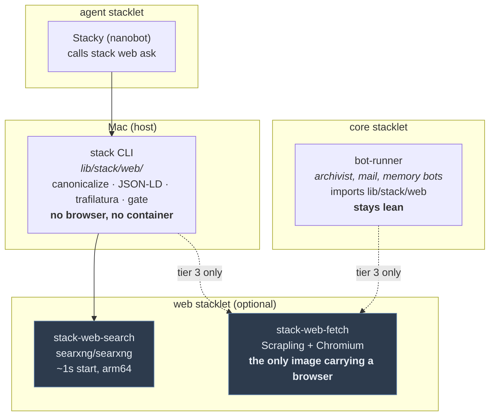
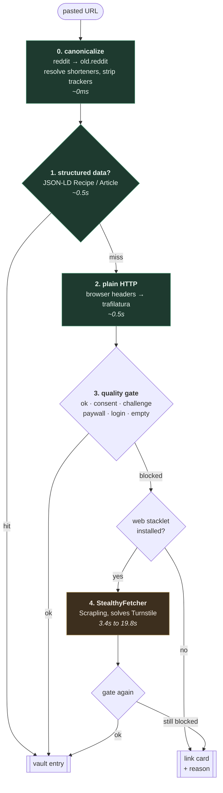

# Web Capture and Search — Implementation Plan

How famstack reads the web: fetching a pasted link, converting it to Markdown,
searching for the family, and refusing to file garbage into the vault.

This plan is written after a measurement session. Every claim below about what
works and what does not is backed by a number in [Spike results](#spike-results),
not by a vendor README.

## Goal

Two user-visible outcomes:

1. **A pasted link becomes a good vault entry, or an honest link card.** Never a
   cookie policy, never a "Just a moment..." challenge page, never a silent ❌
   when the page was simply blocked.
2. **The family can ask questions that need the web.** The agent gets an answer
   plus sources, not a page dump in its context.

## Invariants

- **Nothing leaves the house that does not have to.** No hosted reader APIs
  (jina, Firecrawl), no scraper SaaS. Search reaches upstream engines, and we
  say so plainly rather than claiming anonymity.
- **The cheap path stays cheap.** A recipe or an article must not pay browser
  cost. Tier escalation is driven by failure, never by default.
- **Host-native where possible.** `stack web fetch` works with nothing running,
  same contract as `stack memory topic`.
- **The gate is mandatory.** No extractor output reaches the vault without
  passing a quality check. This is the fix for the class of bug that started
  this work.
- **Degradation is honest.** A blocked page produces a link card that says it
  was blocked, carrying the user's own chat text as the note.

## Architecture in one diagram

### Deployment

The dotted edges are the point: tier 3 is the only thing that needs the
container. Remove the `web` stacklet and tiers 0 to 2 keep working.

### Runtime: the fetch ladder

The gate runs twice on purpose. Tier 4 can also return a challenge page, and it
must not get a free pass just because it is expensive.

## Spike results

Every row measured in one session, same two blocked URLs, same machine.

| Approach | decathlon.de | geizhals.de | reddit post |
|---|---|---|---|
| plain HTTP, famstack UA | 403 | 403 | 403 challenge |
| plain HTTP, Chrome UA | 403 | 403 | 403 challenge |
| `old.reddit.com`, Chrome UA | n/a | n/a | **200, 702 KB** |
| SearXNG built-in geizhals engine | n/a | access denied | n/a |
| lightpanda | challenge, stalls | challenge, stalls | solves challenge, renders no body |
| SeleniumBase UC, headless API | challenge, 14.5s | not run | not run |
| SeleniumBase UC, headed, reconnect 15s | **40s, 6023 chars** | **42s, prices** | escalates to captcha |
| Scrapling `Fetcher` (TLS impersonation) | 403 | CA artifact | 403 hard block |
| **Scrapling `StealthyFetcher`** | **19.8s, 12901 chars** | **3.4s, prices** | not run |

Geizhals prices from SeleniumBase and Scrapling matched exactly
(71,99 / 88,88 / 24,95 / 36,41 EUR), so the numbers cross-validate.

Other measurements:

- **SearXNG**: arm64, 1s cold start, 0.78s to 0.86s per query, 37 to 46 results.
  JSON output is off by default (`search.formats`). Startpage returned CAPTCHA on
  every query; the other engines carried it. Built-in `geizhals` engine exists
  (shortcut `geiz`, category `shopping`, disabled by default).
- **Recipe JSON-LD**: `essen-und-trinken.de` and `einfachkochen.de` both serve a
  full `Recipe` object to a plain fetch, HTTP 200, no bot wall. Yield, totalTime,
  13 ingredients with quantities, 5 instruction steps, nutrition. Deterministic,
  no LLM.
- **Trafilatura tuning**: on old.reddit, `favor_precision=True` returns the
  subreddit sidebar (821 chars). `favor_recall=True, include_comments=True`
  returns the post (5513 chars). Per-domain profiles matter more than the library.
- **No Linux arm64 Google Chrome exists.** SeleniumBase UC Mode therefore needs
  x86 emulation on Apple Silicon, which is where its 40s came from. The scrapper
  image auto-detects arm64, falls back to Chromium, and silently sets `uc=False`.
  Camoufox publishes `lin.arm64`; Playwright's Chromium builds arm64. This is the
  single biggest reason Scrapling wins.

## Re-validation, 2026-09-15

Re-probed before building Phase 1, same two UAs, anonymous, German IP.
Three findings held, one moved.

| Claim | Still true? |
|---|---|
| decathlon.de blocks a plain fetch | yes — 403, Cloudflare `Just a moment...` |
| Recipe JSON-LD on essen-und-trinken / einfachkochen | yes — full `Recipe`, yield, totalTime, 11 and 14 ingredients, steps, nutrition |
| geizhals.de returns 403 | **no** — the *homepage* serves 200 and its real listing. The measured 403 was a product/listing URL; the row overstated it as the whole domain |
| `old.reddit.com` + Chrome UA returns the post | **no — reversed** |

**Reddit now walls anonymous readers.** `old.reddit.com` answers a 302 to
`/login/?reason=lor2`, and `www.reddit.com` serves an 8 KB JavaScript
shell. The `.json` endpoint is 403 with a 190 KB HTML block page.

This is worth more than a corrected row, because of the *shape* of the
failure. The login redirect ends on HTTP 200 with a 320 KB body and a
friendly `<title>Welcome to Reddit</title>` — which is exactly what a
"did the extractor return a string?" success check reads as an article.
The drift did not break the gate's design, it validated it: `login` was
already in the verdict set, and the landing URL is the only honest
signal on that page. The gate reads the URL a fetch *ended* on for
precisely this reason.

The reddit profile keeps its `old.reddit` rewrite anyway. It no longer
recovers the post, but it moves the reported reason from `empty` ("the
page was blank") to `login` ("reddit wants you signed in"), which is the
one a person can act on — and it starts working again unchanged if
reddit relaxes.

## Decision: one stacklet, but not for everything

The tempting version is a `web` stacklet that owns all web operations including
link fetching. Rejected, but the opposite extreme is rejected too.

**Scrapling must not go into `bot-runner`.** It pulls Playwright, Patchright and
a Chromium build, roughly 250 MB. Putting it there taxes every bot image (docs,
mail, memory) with a browser that most of them never invoke.

**Tiers 0 to 2 must not go into a container.** JSON-LD parsing, trafilatura and
the gate are pure Python over bytes. Making them a network hop would break
`stack web fetch` when nothing is up, and would make the archivist depend on an
optional stacklet for the 95% case that never needed a browser.

So the split is by weight, not by topic:

| Layer | Lives in | Why |
|---|---|---|
| canonicalize, JSON-LD, HTTP, trafilatura, gate | `lib/stack/web/` | pure Python, shared by CLI and bots, no new deps |
| search | `web` stacklet, searxng service | genuinely a service |
| stealth fetch | `web` stacklet, fetch service | isolates the 250 MB browser payload |

The stacklet is what *stops* this being heavy. It makes the browser opt-in by
construction: a family that never pastes a shop link never downloads Chromium.

## Phases

### Phase 1 — Framework module and the gate — SHIPPED

The whole fix for both reported bugs, with no new container.

- `lib/stack/web/content.py`: promote `SourceContent` out of
  `stacklets/docs/bot/extractors.py`. Precedent: `stack.email_message` owns the
  shared type, the stacklet owns its mapping.
- `lib/stack/web/quality.py`: gate returning `ok | consent | challenge | paywall
  | login | empty`. The reason is a value, not a bool, because it drives the chat
  reply and the logs.
- `lib/stack/web/profiles.py`: per-domain rules. Ships with reddit
  (`old.reddit` rewrite, recall extraction), Google Maps place URLs (parse the
  place name and address out of the resolved path), and a default profile.
- `lib/stack/web/structured.py`: JSON-LD `Recipe` and `Article`. Must handle
  "this is a listing page, not a recipe" and fall through.
- `lib/stack/web/fetch.py`: tiers 0 to 2 plus the gate. Tier 3 hook present but
  unimplemented.
- `extractors.UrlExtractor` becomes a thin wrapper, same signature, so
  `capture_pipeline` and its tests do not churn.
- `capture_pipeline.capture_url` stops treating "some text" as success and
  renders a link card carrying the gate reason.

**Verification gate.** Four fixtures captured from the real failures in this
session: Cloudflare challenge, Google consent page, Reddit verification
interstitial, essen-und-trinken recipe with JSON-LD intact. Unit tests run
offline against them, no network. The gate must classify all four correctly.
Manual: paste the Google Maps link and the decathlon link into a rig room and
confirm neither produces a fabricated entry.

**Harness improvement.** Add `tests/fixtures/web/` and a small helper that
loads a fixture and asserts a gate verdict, so adding a site profile later
costs one fixture plus one line.

### Phase 2 — The `web` stacklet, search half — SHIPPED

- `stacklets/web/` with `stacklet.toml`, compose, `config/settings.yml`
  (`use_default_settings`, generated `secret_key`, `formats: [html, json]`),
  caddy snippet for the family-facing search page.
- `stacklets/web/cli/search.py`: `stack web search <query> [--json]`.
- `stacklets/web/cli/fetch.py`: `stack web fetch <url>`, host-native, tiers 0 to 2.

**Verification gate.** `stack web search "immich vs photoprism" --json` returns
results with non-empty titles and URLs. `stack web fetch` on a recipe URL prints
ingredients with no container running at all. Teardown removes the container and
leaves no cron entry.

**Harness improvement.** A `stacktests` lane that asserts the JSON API is
enabled, since `formats` defaulting back to `[html]` is a silent failure mode.

### Phase 3 — `stack web ask` (about half a day)

Search snippets plus one local model call. No browser, no multi-step tool use,
which is what makes this cheap and reliable.

- Top N SearXNG snippets into a summarize prompt against the configured `[ai]`
  model, returning an answer plus source URLs.
- Stacky calls this one command through its existing `exec` tool. No MCP server,
  no second agent surface, and no page content in the agent's context.

**Verification gate.** Ask a question whose answer is in the snippets and one
whose answer is not. The second must say it does not know and still list
sources, rather than inventing an answer.

**Harness improvement.** Record a fixture of a SearXNG JSON response so the
summarize step is testable without network or model.

### Phase 4 — Stealth tier (about half a day, gated)

Opt-in, off by default.

- `stack-web-fetch` service in the `web` stacklet: small Python HTTP API over
  Scrapling `StealthyFetcher`, `solve_cloudflare=True`.
- `lib/stack/web/fetch.py` tier 3 calls it when the gate says `challenge`, and
  skips silently when the stacklet is absent.
- Pin `browserforge`. The spike hit an import-time failure without a pin.

**Verification gate, and this gates the phase.** Must be proven inside a
`linux/arm64` container, **headless**, not on macOS. The spike ran on macOS
arm64 and headed; every public stealth benchmark is also headed, so headless is
the untested axis and the one we ship. Then: decathlon and geizhals both return
real content through the service.

Two ceilings to write into the gate rather than discover in it:

- **`real_chrome` can never be true on arm64.** Patchright's own guidance is to
  run real Google Chrome via `channel="chrome"`, and Chrome for Testing
  publishes no `linux-arm64` build. On arm64 Playwright falls back to a
  Chromium `headless_shell`. The weaker configuration is permanent, not a
  setup mistake.
- **Tier 3 is a treadmill, not a milestone.** Cloudflare turned on default
  AI-crawler blocking for free plans on 2026-09-15, with Web Bot Auth
  (Ed25519-signed requests, a published JWKS, an application process) as the
  sanctioned alternative. A self-hosted family stack cannot join that
  programme, so the web is splitting into "identify yourself cryptographically"
  and "be indistinguishable from a browser", and famstack is structurally on
  the second path. Keep tier 3 opt-in, behind the `Transport` seam, degrading
  to an honest link card. Budget for it breaking.

**Harness improvement.** A `stacktests` case that asserts the gate escalates
exactly once and never loops between tier 2 and tier 3.

## Landscape check, 2026-09-15

A survey of the agentic-browser and agent-web-access space, assessed against
this stack's constraints (arm64 only, nothing hosted, AGPLv3-compatible,
container weight, a local ~30B model). Three things changed a decision; the
rest confirmed one.

**Structured data is the right long bet, and the competing standard is not.**
JSON-LD now appears on about 41% of mobile pages and is still growing, which
is why tier 1 reads a recipe deterministically and never asks a model. By
contrast **`llms.txt` is a dud**: across 137,000 domains surveyed, 97% of
`llms.txt` files received zero requests in a month, and most of the fetches
that did happen were not AI tools. Not worth implementing. `NLWeb` (sites
answering natural-language queries over their own schema.org data) is the one
to watch, because it makes the JSON-LD reader more valuable rather than
obsolete. `WebMCP` is a browser-side JavaScript API in a Chrome origin trial,
so it does nothing for a server-side fetcher.

**Nothing beats trafilatura inside these constraints.** Everything that
measurably wins on extraction quality is a 0.6B transformer needing 1.5 GB of
weights, or x86-only, or non-commercially licensed. Worth knowing that every
benchmark in this space is published by someone shipping a competitor, and the
same library scores 0.924 and 0.6402 depending on who counts. One adjacent
finding: `html2text` (used by `stack.email_message`, not by this module) is the
weakest dependency we have, and `html-to-markdown` replaces it at MIT, zero
Python dependencies, native arm64 wheels, ~7 MB.

**The capability bar for browser agents is far lower than the marketing.**
ClawBench, 153 everyday tasks across 144 live sites: the best score ever
recorded is 33.3%, and the same models score 65 to 75% on traditional web
benchmarks. Princeton's cost-instrumented leaderboard puts real-web multi-step
success at 40 to 42%, at hundreds of dollars per benchmark run. This is the
evidence behind phase 3 being search snippets plus one model call rather than
multi-step tool use: nobody has a reliable web agent, least of all on a local
model.

**Licence traps, in the PriceBuddy category.** `Notte` is SSPL. `DrissionPage`
permits non-commercial use only, in Chinese, while GitHub reports it as
`NOASSERTION` so an automated check will not catch it. `rebrowser-patches` has
no licence file at all. `SurfSense` is Apache-2.0 except the directory
containing its SearXNG connector, which is BSL 1.1.

## What we are explicitly NOT building

- **lightpanda.** Solved the challenges on every blocked page and still returned
  no content. Lost on Reddit too, where it rendered nav and footer with an empty
  comments section.
- **SeleniumBase UC Mode.** Same capability as Scrapling, 12x slower, and needs
  x86 emulation because Google ships no Linux arm64 Chrome.
- **CloakBrowser.** The binary is proprietary and the free tier requires signing
  in with GitHub. A self-hosted privacy stack must not phone out to authenticate
  before it can read a page.
- **PriceBuddy.** Good architecture, and it is where the SeleniumBase lead came
  from. Its licence is headed "GPL-3.0 WITH MODIFICATIONS" but prohibits
  commercial use and explicitly forbids incorporating it into any product or
  service offering, which is incompatible with how famstack is distributed. Its
  shipped compose also enables affiliate link rewriting by default.
- **A price comparison scraper.** Geizhals is reachable via tier 3, but a
  scheduled scraper across many installs is a different thing from one family
  reading a page it would have opened anyway. Revisit as an explicit opt-in
  price watch, never as a default.
- **An MCP browser server for the agent.** Would put raw page content back in
  Stacky's context, which is the thing `stack web ask` exists to avoid.

## Open decisions

1. ~~**Image size budget for `stack-web-fetch`.**~~ **Resolved, and the
   fallback was backwards.** Measured: the official `pyd4vinci/scrapling`
   `linux/arm64` image is **644 MB compressed**, of which 441 MB is
   `playwright install chromium` and 138 MB is `uv sync --all-extras`.
   Installing only `[fetchers]` and `playwright install --only-shell chromium`
   puts the floor around **400 MB**. Chromium's own apt dependencies rule out
   250 MB, so the budget moves rather than the design.

   Camoufox is no longer the escape hatch: **Scrapling dropped it entirely at
   v0.3.13**, and `StealthyFetcher` is now patchright over Playwright Chromium
   with a built-in Turnstile solver. Camoufox's `lin.arm64` asset is **623 MB
   zipped on its own**, so "use Camoufox directly" is now a step backwards.
   The arm64 story is patchright and Playwright shipping native aarch64
   wheels, not Camoufox's builds.
2. **Does tier 3 stay synchronous?** At 3.4s to 19.8s it fits in a chat round
   trip behind the existing 👀 ack. If real-world pages cluster at the slow end,
   it becomes a background job and the reply becomes "fetching, will file it".
3. **Whether to enable SearXNG's `geizhals` engine.** It parses prices and specs
   into structured fields, but returned access denied directly. It would only
   work routed through tier 3, which the engine has no hook for.

## Where to look

- `docs/design/agent/plan.md` for the agent phases this feeds.
- `docs/design/agent/pointer-memory.md` for the context-hygiene argument behind
  `stack web ask`.
- `stacklets/memory/cli/topic.py` for the host-native CLI pattern the `web` CLI
  plugin follows.
