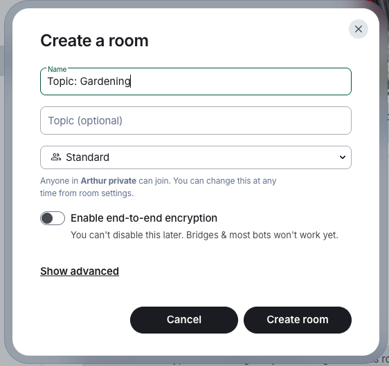

# User Guide

famstack turns the Mac in the corner into the household brain, and you use it from a messaging app on your phone. You talk, paste, photograph and ask; famstack files, transcribes, tags, categorizes and answers.

What that gets you:

- **A wikipedia of your family.** Documents, notes, links and voice memos become a curated wiki of your family life. Searchable, browsable, owned by you.
- **Paperwork that files itself.** Photograph a letter, send it to chat, done. OCR'd, tagged, findable forever.
- **Your family's memories, kept.** Your kids' voices, the funny things they said, bedtime stories in their own words. Record them in the chat and famstack turns them into a family diary you read back month by month. Your personal family story at your fingertips.
- **Answers instead of folder hunting.** Ask "when does the car insurance renew?" and get the answer, with sources.
- **Never miss a thought.** Voice memos become clean, filed, searchable notes.
- **Nothing leaves the house.** No cloud, no subscription, nobody else reading your family's life. It all runs on your own Mac.

This guide is for everyone in the family: what to type, what comes back, and what the archivist (the bot doing most of the work) can do for you.

Setting the server up, or keeping it running? That is the [Admin Guide](admin-guide.md).

> [!TIP]
> **Try the Memories Room.** Record a voice message for your kids tonight, and tomorrow morning it is in your family diary. After four months of recording memos and our kids' voices, it has already become one of our most valuable artifacts. [How it works](#the-memories-room)

> [!TIP]
> **On your phone, turn on threads.** In Element X: **Settings > Labs > Threads**, then close and reopen the app. The archivist answers in threads, you correct it there, and each diary card sits in the thread under its memory. Without threads those replies land in one flat list.

## How do I...?

| You want to | Go to |
|---|---|
| Record the kids, keep the stories | [The Memories Room](#the-memories-room) |
| Read the family diary | [The family diary](#the-family-diary) |
| Fix a name or a date in a memory | [Put a memory right](#put-a-memory-right) |
| File a letter, receipt or contract | [File documents](#file-documents) |
| Find a document again | [Ask questions](#ask-questions) |
| Save a link, note or PDF for later | [Capture rooms](#save-anything-capture-rooms) |
| Collect everything about one project | [Topic rooms](#topic-rooms) |
| Get email into the family chat | [Email](#email) |
| Capture a thought without typing | [Voice memos](#voice-memos) |
| Fix a wrong tag or title | [Correct bot mistakes](#correct-bot-mistakes) |
| Browse what the family knows | [The family wiki](#the-family-wiki) |

---

## The rooms

After install, your chat has these rooms:

- **#Family Chat**: where the family talks. Photos, voice memos, plans, life.
- **#Server Room**: where the server talks back. Status, alerts, install confirmations. Mostly for the admin.
- **#Documents**: the household paper inbox. Everything you drop here lands in the document archive.
- **#Memories**: a place to record your family's life. More on this [below](#the-memories-room).

You can create as many rooms as you like. Any room you invite the archivist into becomes a [capture room](#save-anything-capture-rooms), and a room named `Topic: ...` becomes a [topic room](#topic-rooms). Create bot rooms **with encryption disabled** — the bots cannot read encrypted messages (see [the note below](#save-anything-capture-rooms)). The bot posts a short welcome when it joins, explaining what fits in that room. Type `help` (or just `?`) any time to read it again.

---

## File documents

> Needs the `docs` stacklet. Auto-tagging needs `ai`.

Photograph a letter, a receipt, a contract, an insurance policy. Send the photo (or PDF) to **#Documents**. That's it.

The archivist OCRs it, reads it, and files it: a title, a topic tag, the family member it concerns, who sent it. You see a read receipt while it works and get a reply when it's done:

> 📄 Filed: **Car insurance renewal 2026**
> Insurance · Homer · Springfield Insurance

Write a caption with the upload ("this is for the tax file") and the archivist takes it into account when filing.

For multi-page documents, type `(` to open a scan session, send the pages one by one, then `)` to close it. The pages become one document.

Useful in #Documents:

- **Type any word to search.** `insurance` finds every insurance document. Short queries are fine.
- **`show 42`** posts document 42 into the chat.
- **Ask a question.** Anything with a question mark gets an answer with sources, not just a list. See [Ask questions](#ask-questions).

---

## Save anything: capture rooms

> Needs the `docs` and `code` stacklets.

A capture room is any room the archivist is in, except #Documents. Create a room ("My notes"), invite the archivist, done. DMs with the bot work the same way.
Archivist captures your notes, thoughts and links for you. The bot 
creates summaries, tags them so you can find them again and starts to build your 
personal knowledge base.

> ⚠️ **Create bot rooms with encryption disabled.** The bots cannot read encrypted messages: anything you send in an encrypted room stays private and is simply not processed. If the archivist answers with "I couldn't decrypt that message", the room is encrypted; create a new room and switch encryption off when Element asks (it can't be turned off afterwards).
>
> 
>
> Everything stays on your own Mac either way; the traffic never leaves your network. Encryption protects against your own server, and the bots ARE your server.

What you can drop there:

- **A link.** Becomes a bookmark with a summary. Write something around it ("gift idea for Lisa: https://...") and your words shape the summary.
- **Pasted text.** A paragraph or more becomes a note: summarized, tagged, kept. Short chat messages are ignored, so you can still talk in the room.
- **A PDF.** Becomes a note with the full text preserved, so you can search for any phrase in it later. The UNO rules sheet, the toy manual, the school newsletter.
- **A photo or image.** Becomes a visual bookmark: the AI describes what it sees and files the description.
- **A `.md` or `.txt` file.** Becomes a note with the content kept word for word.
- **A voice memo.** See [Voice memos](#voice-memos).

Everything you capture is filed under your own name in the family archive: Homer's pastes land in Homer's notes and bookmarks, Marge's in hers. The bot replies with what it filed and where.

---

## Topic rooms

> Needs the `docs` and `code` stacklets.

Name a room `Topic: Powerplant Picnic` (German: `Thema: ...`), disable encryption, and invite the archivist. Everything captured in that room files under that subject instead of your personal notes: links, pastes, PDFs, voice memos.

The room becomes the filing system. Plan the picnic in chat, drop the gear list, the location ideas, the photo of the flyer. When it's over you have a complete, searchable record of the project without ever having organized anything.

Questions asked inside a topic room automatically search just that topic. Ask "@archivist what did Lenny suggest?" in the picnic room and the answer comes from the picnic material, not from your tax documents.

---

## Email

> Needs the `core` stacklet, plus `docs` and `code` to file what arrives. Connected by the admin (see the admin guide).

famstack can watch an email account and deliver new mail into a chat room. Once the admin points a mailbox at a room, the family sees each new email as a message, and the archivist files it like anything else you capture.

Each email arrives as a tidy message: subject, sender, date, and the text. Links are shown as plain text, never as something you can tap, so a phishing email can't trick anyone into opening a bad address. The real address is still there to read; it just isn't clickable.

Attachments come in right under the email: a PDF, a photo, a form. Each one is filed the way a document or photo you drop yourself would be: read, summarized, tagged, findable later.

Where mail gets filed depends on who is in the room:

- **A family email room** (more than one person in it) files under the shared family archive.
- **Your own mail** (a private room, or a direct message with the bot, where you are the only person) files under your name.
- **A `Topic: ...` room** files under that subject, like any other topic room.

So you separate work from family, or one person's mail from everyone's, just by choosing which room a mailbox delivers to. When the mail bot joins a room it says which mailbox feeds it; type `help` to read that again.

Newsletters, marketing blasts, and automated noreply mail are filtered out by default, so the brain stays personal and isn't buried in mailing-list noise. (The admin can turn that off if you want everything.)

When a mailbox is first connected, the admin can pull in existing mail from a chosen date (the last week, the whole year) so your history is there from the start, not just new messages.

---

## Voice memos

> Needs the `ai` stacklet.

Send a voice message in any capture room. The archivist transcribes it locally (nothing leaves the Mac), cleans up the transcript, echoes it back so you can check it, and files it as a note.

Several thoughts in a row? Type `(`, send your voice memos, type `)`. The batch becomes one combined note instead of five fragments.

Driving home and something crosses your mind: hold the mic button, talk, done. The thought is captured, transcribed and findable. Never miss a thought.

---

## Correct bot mistakes

The archivist gets things wrong sometimes. Wrong family member, too generic a tag, a title that misses the point. You fix it by replying.

Reply to the bot's filing confirmation with what's off:

> **archivist**: 📄 Filed: **Letter from school** · School · Homer
> **you** (replying): this is Bart's, and it's about the field trip payment

The archivist re-reads the document with your correction, re-files it, and confirms again. Corrections chain: if the second attempt is still off, reply to the new confirmation. Each reply carries the whole conversation back to the original document, so you never start over.

Anything you write in the filing's thread counts as a correction, so you can also just type in the thread the bot answered in, or reply to your own original message. You do not have to quote the confirmation.

This works for captures too: reply to a bookmark or note confirmation and it gets re-filed with your hint.

Memories work the same way, in the thread under each memory: see [Put a memory right](#put-a-memory-right).

---

## Ask questions

> Needs the `ai` stacklet. Sources from the archive need `docs` and `code`.

Two ways to ask:

- In **#Documents**, just type. Search is the default there.
- In **any other room**, @-mention the bot: `@archivist when does the car insurance renew?`

Plain words work as search ("Duff Insurance", "vaccination Bart"). Questions get real answers: the archivist searches the document archive and the family knowledge vault, reads what it finds, and answers with numbered sources you can check:

> The car insurance renews on March 1, 2026 [1]. The premium is EUR 340/year [1][2].

If the first pass isn't enough, it tells you it's looking deeper and reads the actual documents. Search is young (this is version 0.1 of it) but it's already the fastest way to settle "when did we..." questions at the dinner table.

---

## The family wiki

> Needs the `memory` stacklet.

Everything the archivist files becomes more than a pile of documents: the memory stacklet renders it as a wiki of your family life. A home page, a page per family member, topic pages, a page per correspondent (the insurance company, the school, the doctor's office).

Open it at `http://<mac-ip>:42070` (or `memory.<your-domain>` if the admin set up a domain). It updates itself as things get filed.

The menu on the left is sorted by what you look for, not by how the files are stored:

- **Recent**: the topics where something was filed in the last four weeks.
- **Diary**: the family diary, month by month.
- **People**: a page per family member.
- **Topics**: everything filed about a subject, grouped by area of life (money and work, health, home, the car, …). A topic appears once something is filed under it, with the number of entries next to it.
- **Documents**: every document by type, by year and by sender.
- **Notes & links**: every note and saved link, newest first.

The menu follows the language set for your famstack.

Every page has an edit link: edits happen in Forgejo (the family's private git server), so every change is tracked and nothing is ever lost. If you use Obsidian, you can clone the vault and browse it there; it's all plain Markdown.

---

## The Memories Room

> Needs the `memory` stacklet. Voice messages need the `ai` stacklet; the cards in the room need the archivist (`docs`).

One of the most valuable things you can do with famstack has nothing to do with documents. If you try one thing, make it this room.

The Memories Room keeps what photos can't: your kids' voices, the funny things they said, bedtime stories in their own words. We record a voice diary once or twice a week at the dinner table: what was funny, what was special, what the kids want to tell their future selves. Holiday diaries, first days at school, a birthday message. We wish we had started with our first son.

famstack does more than keep them. Every night it transcribes what you recorded, works out the date and who it was for, and writes it into a family diary you can read back month by month, with every recording one tap away. You don't type, tag or file anything. This is the feature that keeps gaining value.

A few habits help:

- **Say the date.** Start a recording with "Today is the third of March" and famstack files the memory on that day, even if your phone uploads it a week later. Without a date, the day you sent it counts.
- **Say who it is for.** Start with "Hi Bart, ..." and famstack files the memory as a message to Bart. The diary shows it whole, as a letter.
- **Reply to add to a memory.** The diary keeps your reply, or a caption under a photo, with the memory.

The archivist does not reply to anything you post there.

### What happens overnight

Every night, famstack reads the new memories: it transcribes the recordings, and your own AI reads each one for a title, who it is about, a short summary and the facts worth finding again ("Maggie: first tooth", "Swimming badge: 25 metres"). famstack files each memory as a card in the family's archive.

In the morning, the archivist puts each new card in the thread under its memory, and one short note in the room:

> **archivist**: ❤️ 3 new memories in the family diary. [Open the diary]

Both are quiet messages, so no phone buzzes. A memory you post today gets its card tomorrow morning.

### Put a memory right

The AI mishears names and gets things wrong. Correct it in the memory's thread, the way you correct a document: open the thread under the memory, and reply to its card, typed or as a voice message.

> **archivist**: 📔 **Sandcastle at the lake** · Sunday, 20 September 2026 ...
> **you** (in the thread): It was Lisa who built the tower, not Bart. And it was the 19th.

The archivist answers with 👀, puts the corrected card in the thread, and confirms with ✅. You can correct the title, the date, who it is about, who it was for, the summary and the facts. The recorded words themselves stay as they were.

famstack saves your correction in the family's archive under your name, and the card is yours from then on: the nightly run never changes it back. To correct it again, reply in the same thread.

### The family diary

Open it from the note's link, or from the family wiki's home page (**Family Diary**). You read it month by month: a short opening for each month, then every memory under its day, with its title, who recorded it, a short summary, the words as they were said, the photos, and the recordings to play. For a long recording you see a few lines worth keeping, and the full transcript is one click away. A message spoken to one person appears whole.

Transcription and reading run on your household's own AI, so nothing leaves your home. Your memories are just yours.

Start now. You will wish you had started earlier.

---

## When the bot doesn't answer

The archivist is software running on the family Mac, and Macs get rebooted, disks fill up, things happen.

- Give it a minute. Filing a big PDF or answering a deep question takes a moment; the read receipt and typing indicator show it's working.
- "I couldn't decrypt that message"? The room is encrypted, and the bots can't read encrypted messages. Create a new room with encryption disabled (see [capture rooms](#save-anything-capture-rooms)).
- Type `help` in the room. If the bot answers, it's alive and the problem is elsewhere.
- Still nothing? Tell your admin. They'll want to run `./stack status` ([Admin Guide](admin-guide.md#troubleshooting)).

---

## Community

famstack is a small project run by a small group of people who care about it. Stop by, say hi:

- **[Discord](https://discord.gg/hfutdmmfBe)**: install help, "is this normal?" questions, what other families are doing with their stacks.
- **[GitHub](https://github.com/famstack-dev/famstack)**: bug reports, feature requests. A star is the single biggest signal we have to know whether to keep going.

If famstack saved you from another year of manually copying photos off your phone with a cable, the kindest thing you can do is tell one other family about it.
